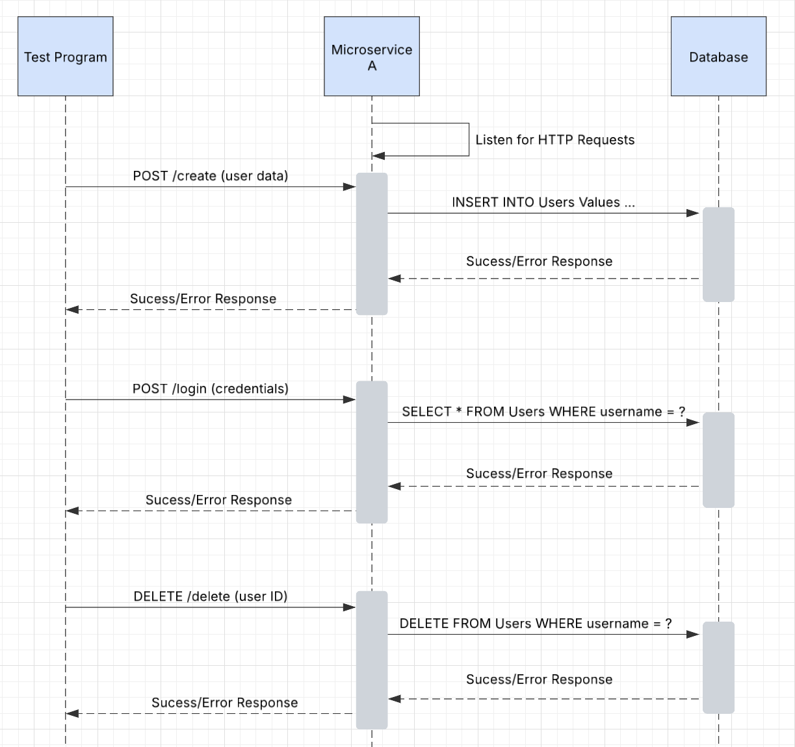

# Microservice-A

A. To interact with the microservice programmatically, an application must send HTTP requests to the designated endpoints: /create, /delete, and /login. The microservice listens for requests on http://localhost:51336 and processes the data accordingly. Below is an example call of the endpoint /create.

B. To programmatically receive data from the microservice, an application must parse the JSON-formatted data that is sent back from the client. This response contains messages and status codes indicating whether the request was successful or encountered an error. Below is an example of parsing the status_code returned in the response.

C. The diagram below illustrates how data flows between the application and the microservice. 

** Before running the program locally make sure to fill in the config file and to import the sql file into your database.
